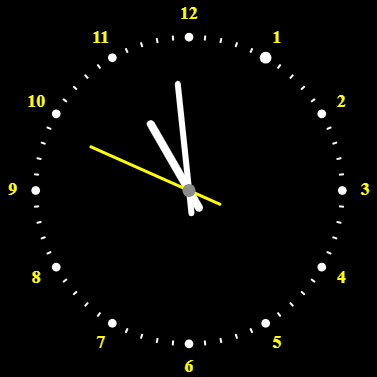

# SiClo - A Simple Clock Implementation For The Web

This is really just a simple analog clock.

> The original SiClo for Windows is made by  József Szoldatics, and is available here: [link](https://www.szolda.hu/page.php?num=61)

## Controls
- ```Ctrl + I``` - Display or hide the current time in digital form.
- ```Ctrl + D``` - Display or hide the current date.
- ```Right click``` - display help menu
- ```F11``` - Enter full screen.

## Features
The app is made for mobile and desktop devices, so the page will be fully responsive. It is using a service worker, so the site will be cached on your device and will be available, even if you are offline.

<div style="text-align: center">



</div>